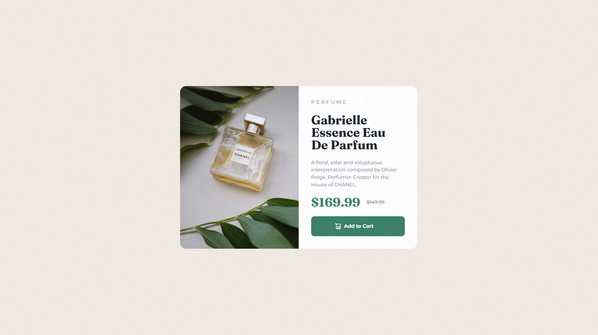
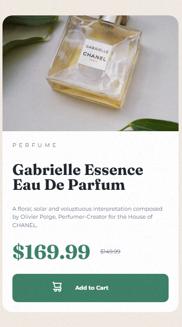

# 🛍️ Компонент предпросмотра товара - Решение для Frontend Mentor 🎨

Этот репозиторий содержит моё решение для [челленджа "Product Preview Card" на Frontend Mentor](https://www.frontendmentor.io/). Целью проекта было создать адаптивную карточку предпросмотра товара, используя семантический HTML и современные практики CSS. 🚀

---

## 📋 Содержание

- [🔍 Обзор](#-обзор)
    - [🖼 Скриншот](#-скриншот)
    - [🔗 Ссылки](#-ссылки)
- [⚙️ Мой процесс](#-мой-процесс)
    - [🛠 Используемые технологии](#-используемые-технологии)
    - [📚 Чему я научился](#-чему-я-научился)
- [👨‍💻 Автор](#-автор)

---

## 🔍 Обзор

Проект был сосредоточен на создании чистой, адаптивной карточки товара, которая корректно работает на различных устройствах. Основной задачей было максимально точно воспроизвести предложенный дизайн, обеспечивая при этом доступность и интерактивность.

### 🖼 Скриншот

#### Версия для компьютеров

#### Мобильная версия

### 🔗 Ссылки

- [📂 Репозиторий](https://github.com/hamptooon/product-preview-card)
- [🌐 Демо-версия](https://hamptooon.github.io/product-preview-card)

---

## ⚙️ Мой процесс

### 🛠 Используемые технологии

- 🏗️ **Семантический HTML5** для структурированной и осмысленной разметки.
- 🎨 **CSS Flexbox** для создания адаптивных и гибких макетов.
- 📱 **Mobile-first дизайн**, обеспечивающий плавное взаимодействие на всех устройствах.
- 💻 **SCSS** для лучшей организации и модульности CSS.
- ✨ **CSS Анимации** для добавления интерактивных эффектов при наведении и фокусе.

### 📚 Чему я научился

Этот проект помог мне:

- Попрактиковаться в технике **mobile-first дизайна**, обеспечивая плавные переходы между различными размерами экранов.
- Улучшить навыки работы с **Flexbox** для создания более адаптивных макетов.
- Использовать **CSS Анимации** для состояний при наведении и фокусе, добавляя интерактивные элементы к кнопкам и изображениям карточки.
- Применять **SCSS** для организации кода и его поддержки с помощью модульной структуры и миксинов.

---

## 👨‍💻 Автор

- GitHub - [Hamptooon](https://github.com/hamptooon)
- Frontend Mentor - [Hamptooon](https://www.frontendmentor.io/profile/Hamptooon)

---

🛠 Этот проект является частью моего непрерывного пути в совершенствовании навыков фронтенд-разработки. Не стесняйтесь форкнуть, поставить звёздочку ⭐ или внести свой вклад в проект! 😊