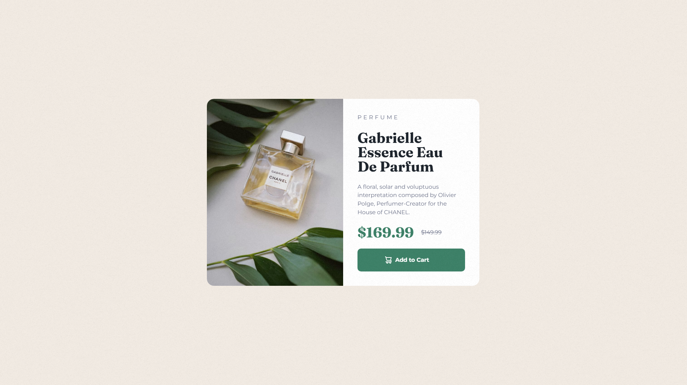

# 🛍️ Product Preview Card - Frontend Mentor Solution 🎨

This repository contains my solution for the [Product Preview Card Challenge on Frontend Mentor](https://www.frontendmentor.io/). The objective of this project was to build a responsive product preview card using semantic HTML and modern CSS practices. 🚀

---

## 📋 Table of Contents

- [🔍 Overview](#-overview)
    - [🖼 Screenshot](#-screenshot)
    - [🔗 Links](#-links)
- [⚙️ My Process](#-my-process)
    - [🛠 Built With](#-built-with)
    - [📚 What I Learned](#-what-i-learned)
- [👨‍💻 Author](#-author)

---

## 🔍 Overview

This project was focused on creating a clean, responsive product card that works seamlessly across different devices. The main challenge was to replicate the provided design as closely as possible while ensuring accessibility and interactivity.

### 🖼 Screenshot

#### Desktop

#### Mobile

### 🔗 Links

- [📂 Repository](https://github.com/hamptooon/product-preview-card)
- [🌐 Live Demo](https://hamptooon.github.io/product-preview-card)

---

## ⚙️ My Process

### 🛠 Built With

- 🏗️ **Semantic HTML5** for structured and meaningful markup.
- 🎨 **CSS Flexbox**  for responsive and flexible layouts.
- 📱 **Mobile-first design** ensuring a smooth user experience across devices.
- 💻 **SCSS** for better CSS organization and modularity.
- ✨ **CSS Animations** to add subtle hover and focus effects for interactivity.

### 📚 What I Learned

This project helped me to:

- Practice **mobile-first design** techniques, ensuring smooth transitions across screen sizes.
- Improve my **Flexbox** skills for creating more adaptable layouts.
- Use **CSS Animations** for hover and focus states, adding an extra layer of interactivity to the card's buttons and images.
- Apply **SCSS** to keep the code organized and maintainable through partials and mixins.

---

## 👨‍💻 Author

- GitHub - [Hamptooon](https://github.com/hamptooon)
- Frontend Mentor - [Hamptooon](https://www.frontendmentor.io/profile/hamptooon)

---

🛠 This project is part of my ongoing journey to improve my front-end development skills. Feel free to fork, star ⭐, or contribute to this project! 😊